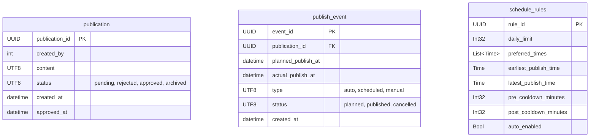

```mermaid
erDiagram
    publication {
        UUID publication_id PK
        int created_by
        UTF8 content
        UTF8 status "pending, rejected, approved, archived"
        datetime created_at
        datetime approved_at
    }

    publish_event {
        UUID event_id PK
        UUID publication_id FK

        datetime planned_publish_at
        datetime actual_publish_at

        UTF8 type "auto, scheduled, manual"
        UTF8 status "planned, published, cancelled"

        datetime created_at
    }

    schedule_rules {
        UUID rule_id PK
        Int32 daily_limit
        List~Time~ preferred_times

        Time earliest_publish_time     
        Time latest_publish_time 

        Int32 pre_cooldown_minutes     
        Int32 post_cooldown_minutes

        Bool auto_enabled
    }
```