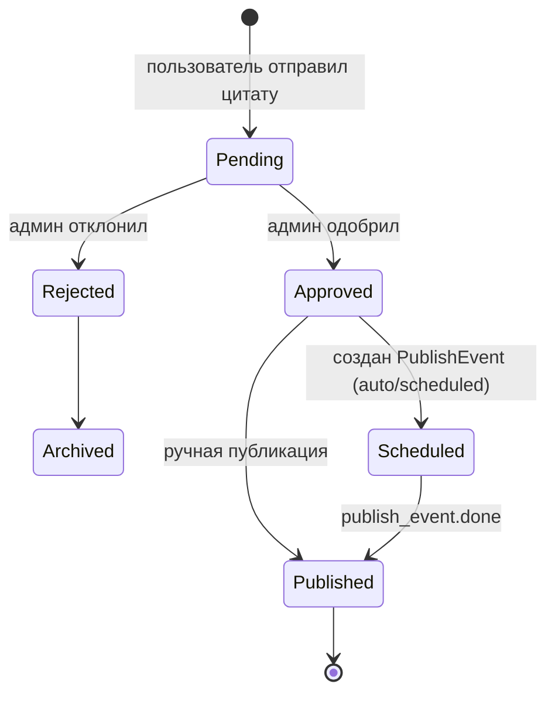
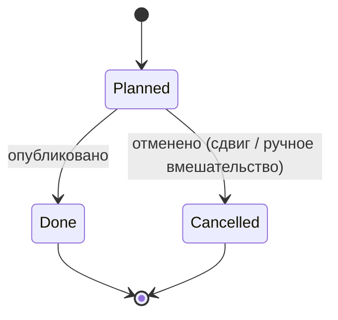
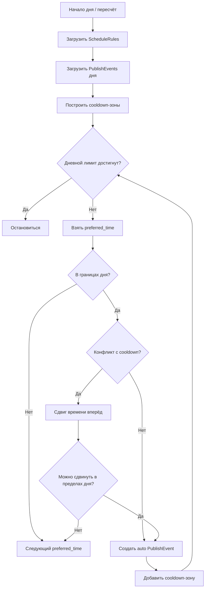
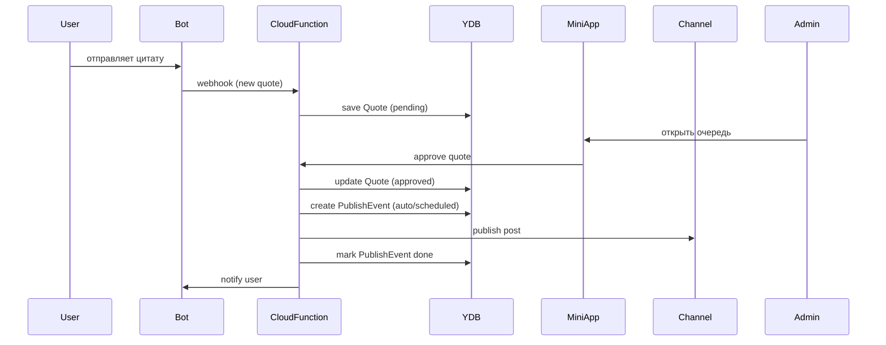
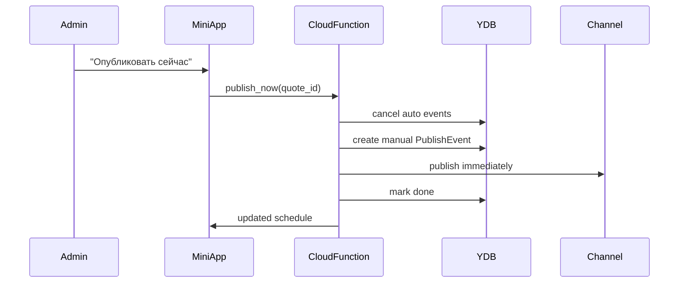

## 1️⃣ Диаграмма сущностей и состояний

### 1.1 Жизненный цикл цитаты

**Комментарии:**

* `Quote` не знает о времени публикации
* Время живёт **только в PublishEvent**
* `Archived` — терминальное состояние

---

### 1.2 PublishEvent (события публикации)

Тип события:

* `auto`
* `manual`
* `scheduled`

---

## 2️⃣ Диаграмма планирования (временная логика)

---

## 3️⃣ Диаграмма взаимодействия компонентов

---

## 4️⃣ Диаграмма ручного вмешательства админа

---

## 5️⃣ Как это читается целиком

* **Quote** — контент
* **PublishEvent** — время и факт публикации
* **ScheduleRules** — глобальные ограничения
* **Cooldown-зоны** — защита от конфликтов
* **Mini App** — источник истины для админов
* **Bot** — транспорт и уведомления

---